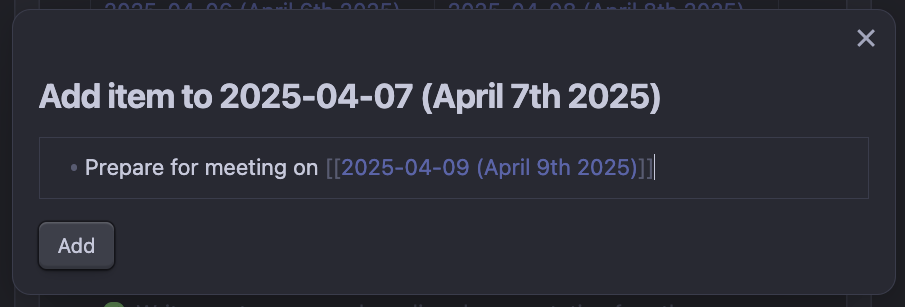
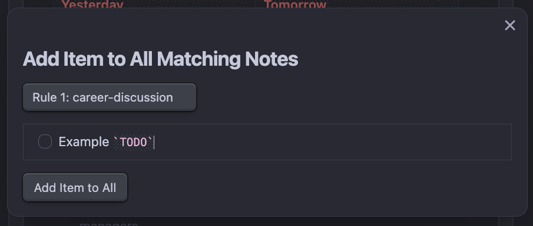
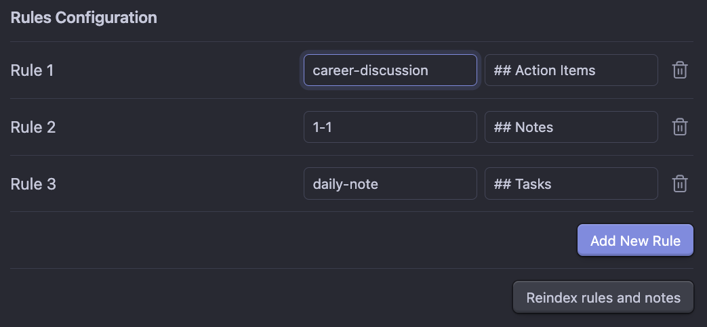

# Add Under Page Heading

**Add items to specific sections in tagged notes via the command palette.**

This plugin allows you to quickly add notes or action items to specific headings in your Obsidian vault—without opening the target file. It's ideal for managers, team leads, or anyone who maintains recurring notes for multiple topics or people.

---

## ✨ Features

- 🧠 Add thoughts, todos, or notes inline using the command palette.
- 🏷️ Supports tagging-based targeting of notes (via YAML frontmatter).
- 🔻 Insert content under a specific heading in the target note.
- 📝 Rich markdown editor with Obsidian-style shortcuts (`Cmd+K`, `**bold**`, etc.).
    - Uses [Fevol](https://gist.github.com/Fevol)'s [Embeddable CM Markdown Editor solution](https://gist.github.com/Fevol/caa478ce303e69eabede7b12b2323838)
- 🔄 "Reindex" button in settings to rescan notes and update commands.
- 🔧 Fully configurable rules for managing where and how content is inserted.

---

## ⚙️ How It Works

1. **Tag your notes** (in frontmatter) with things like `career`, `1-1`, `active`, etc.
2. **Define rules** in the plugin settings:
   - A `tag` to match against your notes’ frontmatter.
   - A `heading` under which new content should be inserted.
3. **Use the command palette** to choose a matching file + rule.
4. A modal appears with a rich markdown editor.
5. Submit your entry—your content is inserted under the configured heading in the target file.

---

## 🛠 Example Use Case

### Inserting Under a Heading of a Particular Note
You're a software engineering manager with a note like:

```markdown
---
tags: [direct-report, career, active]
---

## Career Discussion

- Deliver feedback regarding recent performance
```

If you've configured a rule with:

    tag: career
    heading: ## Career Discussion

You can run the command `Add Under Page Heading: [Page Title]: (## Career Discussion)` and append notes directly under that section of that particular note.



### Inserting Under a Heading of All Notes for a Given Rule

If there are multiple files within the Vault that match a configured rule and you would like to insert into all of them the command `Add Under Page Heading: Add item to all notes matching a rule`.




---

## 🧩 Settings

🧱 Define as many tag + heading rules as you'd like.

➕ Add/remove rules from the plugin settings tab.

🔁 Click "Reindex rules and notes" after making changes to ensure the plugin regenerates its command palette options.



---

## 📦 Installation

### Manual

Build the plugin using `npm run build`.

Copy `main.js`, `manifest.json`, and (optionally) `styles.css` to: `.obsidian/plugins/add-under-page-heading/`

---