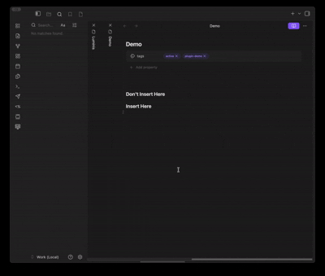
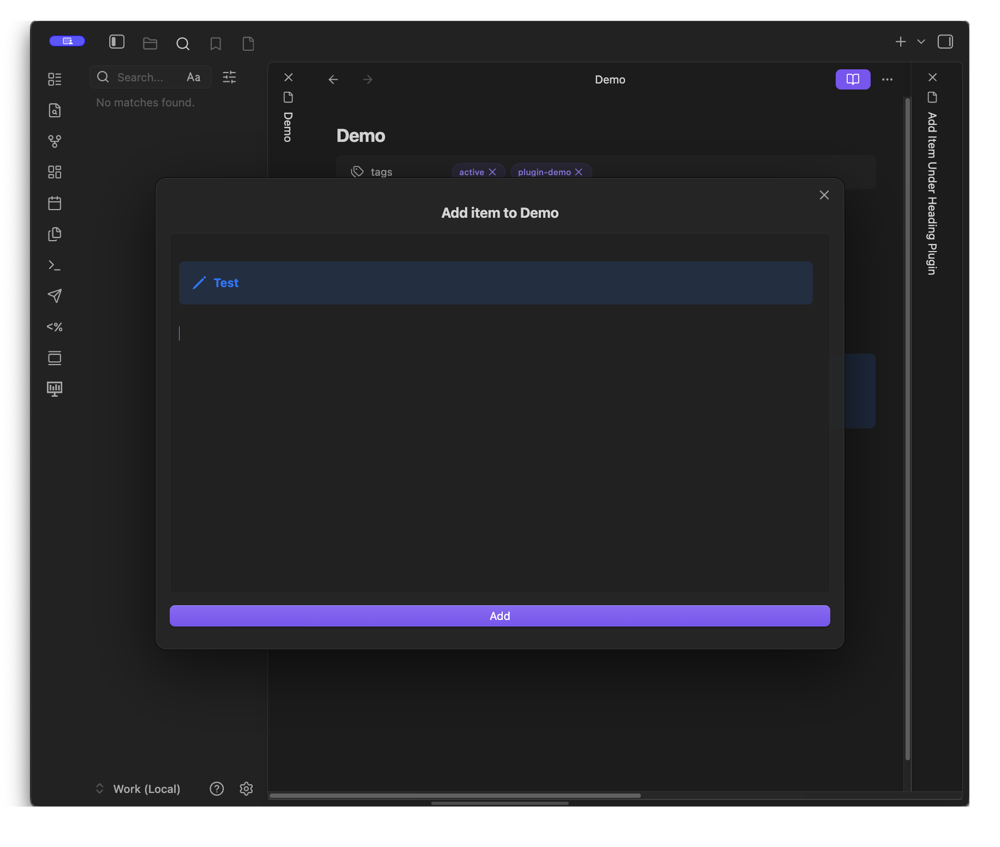
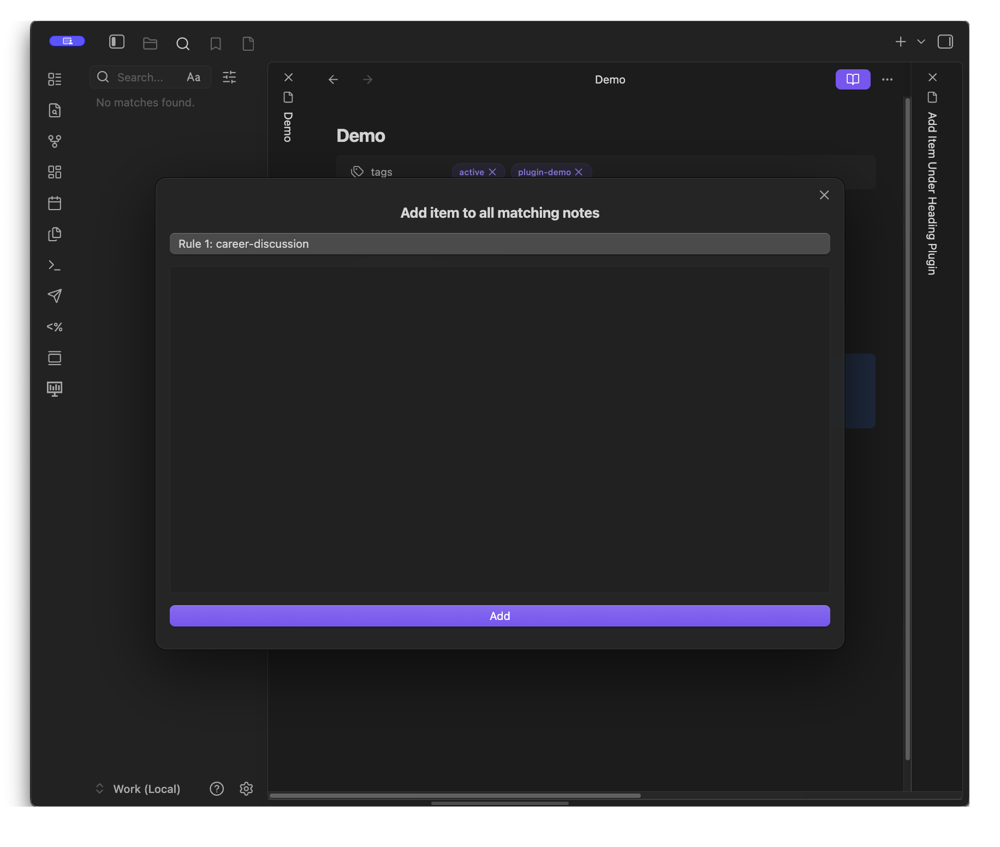
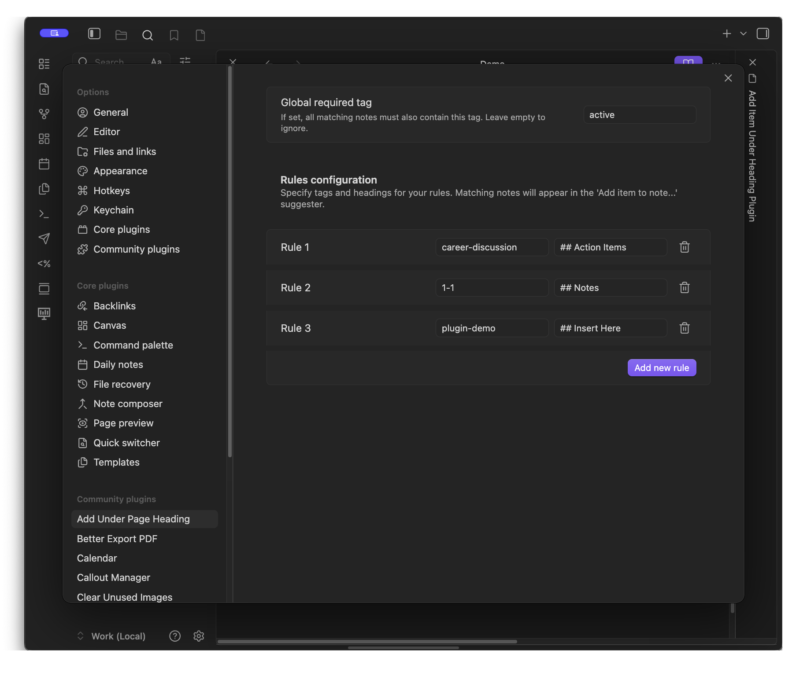

# Add Under Page Heading

Insert note content into other notes or groups of notes based on configured rules through an embedded editor.

Rules require a specified tag and heading. Once configured, notes that match a rule's specified tag criteria appear in the search list when you perform the **Add item under page heading...** command.

Uses [Fevol](https://gist.github.com/Fevol)'s [Embeddable CM Markdown Editor solution](https://gist.github.com/Fevol/caa478ce303e69eabede7b12b2323838).



## Commands

### `Add Under Page Heading: Add item under page heading...`

Search through notes that match the currently configured rules. Selecting a note opens the embedded editor to enter content for insertion under the specified heading.

### `Add Under Page Heading: Add item to all notes that match a rule`

Opens an embedded editor with a dropdown menu to select a specific rule. Entered content is inserted into every note that matches the selected rule.

---

## Features

- **Command palette insertion** — Insert content into a specific note (or all notes that match) under a specified heading directly from the command palette.
- **Rule-based filtering** — Configure rules in the plugin settings to surface specific notes based on tags.
- **Embedded Obsidian editor** — Use the rich markdown editor and command palette options while entering content.

---

## How it works

1. **Tag your notes** — Add tags (in frontmatter) such as `career`, `1-1`, or `active`.
2. **Define rules** — In the plugin settings, specify:
   - A **tag** to match against your notes’ frontmatter.
   - A **heading** under which new content should be inserted.
3. **Perform the command** — Use the command palette to choose a note that matches or bulk insert into all notes that match a rule.
4. **Enter content** — A modal appears with a rich markdown editor.
5. **Submit entry** — Your content is inserted under the configured heading in the target note.

---

## Example use case

### Insert under a heading of a specific note
Consider a manager with a note like this:

```markdown
---
tags: [direct-report, career, active]
---

## Career Discussion

- Deliver feedback regarding recent performance
```

If you configure a rule with:
- **Tag** — `career`
- **Heading** — `## Career Discussion`

You can perform the **Add item under page heading...** command, search for the specific note, and enter the content you would like to have inserted directly under the specified heading.



### Insert under a heading of all notes for a given rule

If multiple notes in your vault match a configured rule, use the **Add item to all notes that match a rule** command to insert content into all of them simultaneously.



---

## Settings

> [!info]+ Future plan
> The **Global required tag** setting will be removed once rules are updated to support multiple tags per rule.



---

## Roadmap 

- Support for rules with multiple tags (e.g., `#projects` and `#active`).
    - Remove global tag setting
- Support default editor contents for rules.
- Support inserting at the top of a note if no heading is provided.
- Automatically remove empty rules when settings are closed.
- Fix modal submit buttons disappearing at shorter screen heights.
- Support reordering of rules.
- Support matches for specified heading level (i.e., `##`, `###`, etc.) in rule configuration.
- Support fuzzy matching headings similar to file names for rules with no heading configured
